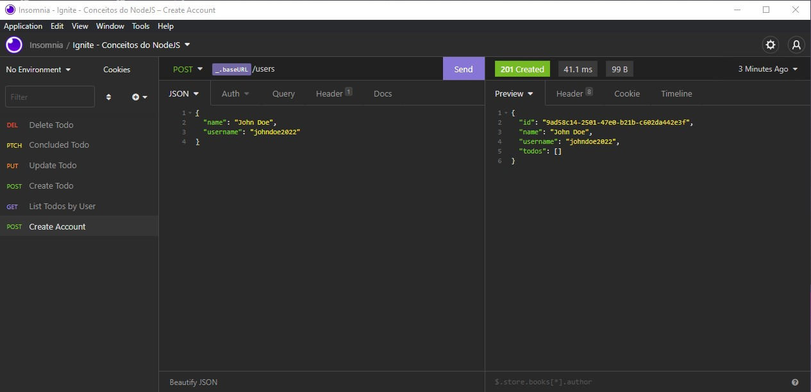
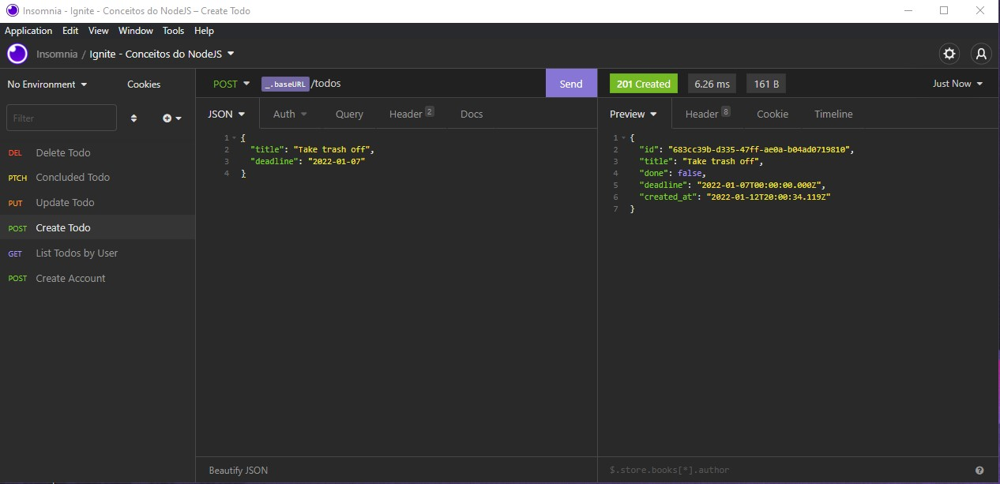
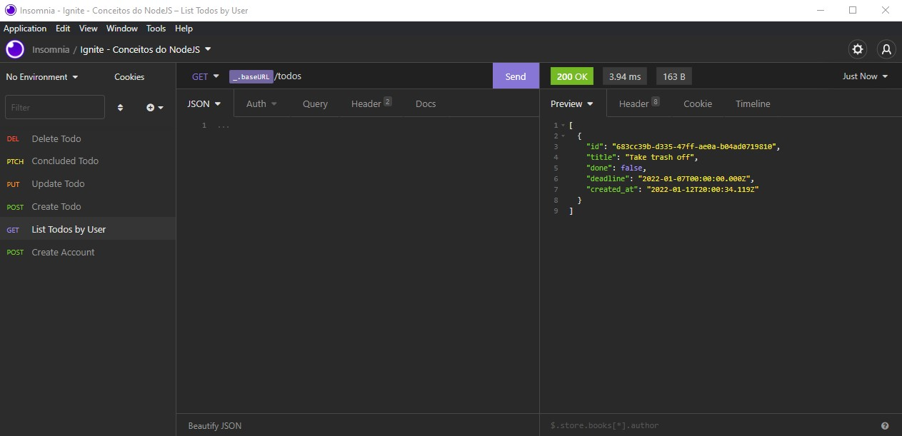
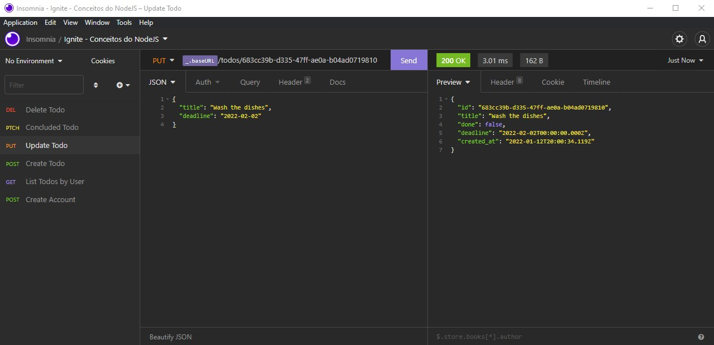
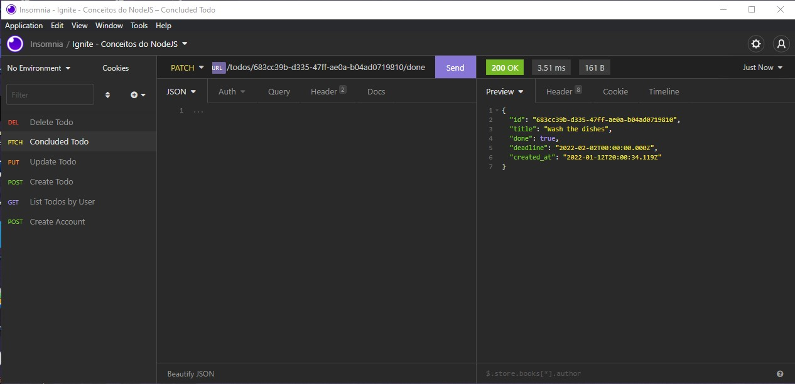
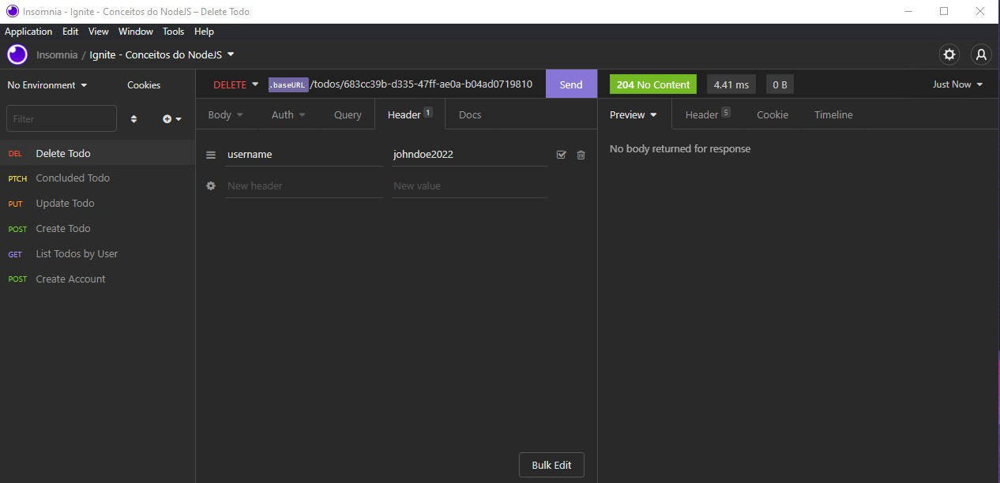

# Conceitos do NodeJS
Esta é uma aplicação NodeJS que simula a implementação de uma Todo List(lista de tarefas) na parte do Back-End, onde realiza-se o CRUD (Create, Read, Update, Delete) dos todos.

Os objetivos principais foram treinar e aprimorar conceitos bases do NodeJS com a Biblioteca Express, como `criação de rotas`, `recebimento e envio de parâmetros do tipo Route, Query e Body` e `utilização de Middlewares`.

Contudo, este é um projeto desenvolvido como Desafio do curso Ignite NodeJS da [Rocketseat](https://www.rocketseat.com.br/).

## 🚀 Technologies
✔ NodeJS
 
✔ JavaScript
 
✔ [Library Express](https://expressjs.com/)
 
✔ [Package Nodemon](https://www.npmjs.com/package/nodemon)
 
✔ [Package uuid](https://www.npmjs.com/package/uuid)
 
✔ [VS Code](https://code.visualstudio.com/)

## ⚙ Settings
* Para executar o projeto você deve baixar os arquivos ou dar um `git clone` do repositório.
* Após baixar rode o comando `yarn` no terminal dentro do diretório do projeto para baixar todas as dependências.
* Depois de baixar as dependências siga os seguintes passos para execução do projeto:
    - `yarn dev`: para executar o servidor na base url `http://localhost:3333`.
    > 🚨 OBS
    > Você pode utilizar o [Insômnia](https://insomnia.rest/download) para testar as rotas da aplicação

## Routes

### /users(POST)
* Demonstration:

### /todos(GET)
* Demonstration:

### /todos(POST)
* Demonstration:

### /todos/:id(PUT)
* Demonstration:

### /todos/:id/done(PATCH)
* Demonstration:

### /todos/:id(DELETE)
* Demonstration:

## ✍ Author

    Made with 💜 by PabloXT14

    
    

